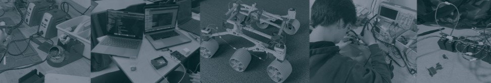

<div align="center">


# Engineering Horizons @ UW
</div>


Welcome to the official repository for **Engineering Horizons**. We are a community of student engineers at the University of Washington dedicated to hardware-software integration, control systems, and building the next generation of autonomous machines.


## Current Projects

### Robotic Arm
A multi-DOF (Degree of Freedom) arm designed for precision tasks. We are currently focusing on:
* **Inverse Kinematics:** Implementing algorithms for smooth coordinate-based movement.
* **Control Systems:** Integrating high-torque servos with real-time feedback loops.
* **Computer Vision:** Future-proofing for object recognition and pick-and-place automation.

### Line Following Robot
Our high-speed autonomous navigator. This project serves as our testing ground for sensor fusion and PID control.
* **PID Tuning:** Optimizing proportional, integral, and derivative constants for smooth cornering.
* **Sensor Array:** Utilizing IR reflectance sensors for high-frequency path correction.
* **Modular Chassis:** Lightweight 3D-printed design for maximum agility.

## Tech Stack

Our team works across the full robotics stack, from low-level firmware to high-level path planning.

| Category | Tools & Technologies |
| :--- | :--- |
| **Compute** | Raspberry Pi, Arduino, ESP32 |
| **Languages** | Python, C++, TypeScript |
| **Mechanical** | SolidWorks, 3D Printing (PLA/PETG) |
| **Electronics** | PWM Control, I2C/SPI Communication, Custom PCBs |


<!-- ## 👥 Leadership Team

* **Club Officers:** Engineering Horizons Lead Team
* **Software Team Lead:** Blake Robinson

We are always looking for passionate members to join our sub-teams in Mechanical Design, Electrical Engineering, and Software Development.

-->

## 📂 Getting Started

To contribute to our project repositories:

1.  **Clone the Repo:**
    ```bash
    git clone [https://github.com/Engineering-Horizons/project-name.git](https://github.com/Engineering-Horizons/project-name.git)
    ```
2.  **Environment Setup:**
    <br>
    a. Ensure you have your virtual environment configured (we recommend `venv` for Python projects).
    ```bash
    python3 -m venv env
    source env/bin/activate
    pip install -r requirements.txt
    ```
    <br>
    b. For C++ or Arduino projects, ensure you either have PlatformIO installed on VSCode or are using the ArduinoIDE.

<!-- 
## Join Us

Engineering Horizons meets weekly at the UW campus.

* **Slack:** [Join our Server]
* **Email:** [club-email@uw.edu]
* **Meeting Times:** Check the calendar in the Wiki. -->


> *"The best way to predict the future is to build it."*